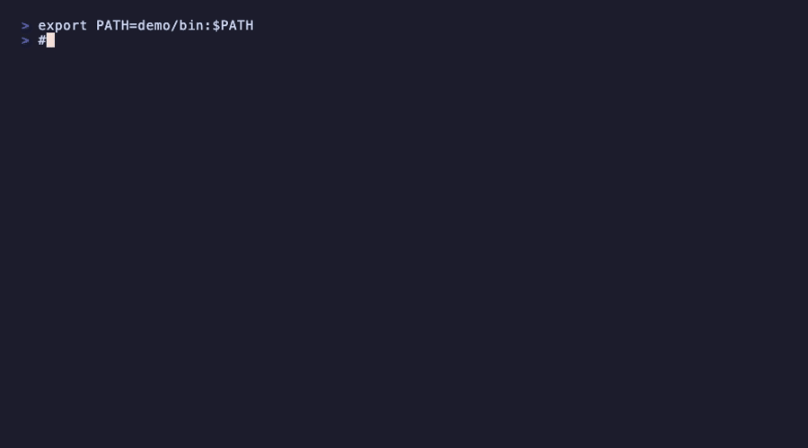

<p align="center">
  
</p>

```
echo "lux" | lux -r "(l):yellow:cap1" -r "(u):magenta:cap1" -r "(x):cyan:cap1"
```

**Lit Up teXt** — colors your logs, highlights your files, and filters your output. Pipe anything through it and get the right colors applied to the right patterns, zero configuration needed for common cases.

## Install

**Pre-built binary (recommended):**

```bash
curl -fsSL https://raw.githubusercontent.com/grimurjonsson/lux/main/scripts/install.sh | bash
```

**From source:**

```bash
git clone https://github.com/grimurjonsson/lux.git
cd lux
just install
```

Requires [Rust](https://rustup.rs/) and [just](https://github.com/casey/just).

## Quick Start

```bash
lux -f app.log                              # follow with auto-coloring
lux -f app.log -r 'ERROR:red'               # add custom rules
lux -f app.log -t ERROR -b 5 -a 10          # trigger on ERROR with context
```

<p align="center">
  
</p>

## Usage

### Pipe mode

Pipe any output through `lux`. Log levels are colored automatically:

```bash
tail -f /var/log/syslog | lux
docker logs -f myapp | lux
kubectl logs -f pod/api | lux
```

<p align="center">
  
</p>

### File mode

Read a file directly — prints with syntax highlighting (like `cat` with colors):

```bash
lux README.md
lux config.yaml
lux src/main.rs
```

Show last N lines (like `tail`):

```bash
lux -n 50 app.log
```

Open in interactive pager instead (like `less`):

```bash
lux --less app.log
```

Navigate with `Space`/`b` (page), `j`/`k` or arrows (line), `g`/`G` (top/bottom), `q` to quit. Text selection and copy works normally.

Follow a file (like `tail -f`):

```bash
lux -f app.log       # follow by descriptor
lux -F app.log       # follow by name (handles log rotation)
```

Set the default file mode:

```bash
lux config default-file-mode less   # use pager
lux config default-file-mode cat    # print-and-exit (default)
```

### Syntax highlighting

Open code and config files with automatic syntax coloring (powered by [syntect](https://github.com/trishume/syntect) with Catppuccin Mocha theme):

```bash
lux src/main.rs
lux config.yaml
```

<p align="center">
  
</p>

### Custom rules

Add coloring rules with `-r PATTERN:STYLE[:SCOPE]`:

```bash
# Color ERROR lines red, WARN lines yellow
tail -f app.log | lux -r 'ERROR:red' -r 'WARN:yellow'

# Bold + color
echo "CRITICAL failure" | lux -r 'CRITICAL:bold+red'

# Color only the matched text (not the whole line)
echo "user=admin action=login" | lux -r 'admin:green:match'

# Color only a capture group
echo "time=12:34:56 msg=hello" | lux -r 'time=(\S+):cyan:cap1'
```

**Rule format:** `PATTERN:STYLE[:SCOPE]`

| Part | Description |
|------|-------------|
| `PATTERN` | Regex pattern to match |
| `STYLE` | Color/style (see below) |
| `SCOPE` | `line` (default), `match`, or `cap1` |

**Styles:** `red`, `green`, `yellow`, `blue`, `magenta`, `cyan`, `white`, `dim`, `bold`, `italic`, `underline`. Combine with `+`: `bold+red`. Use hex (`#ff5500`), 256-color (`208`), or `bg-color` for backgrounds.

Run `lux --list-colors` to see all available colors and styles.

<p align="center">
  
</p>

### Filtering

Show only lines matching a pattern:

```bash
tail -f app.log | lux -i 'ERROR|WARN'
```

Hide lines matching a pattern:

```bash
tail -f app.log | lux -e 'DEBUG' -e 'TRACE'
```

Combine both:

```bash
tail -f app.log | lux -i 'user-service' -e 'healthcheck'
```

<p align="center">
  
</p>

### Triggers

Suppress output until a pattern matches, then show a context window around it:

```bash
# Show 20 lines before and after each ERROR
tail -f app.log | lux -t 'ERROR'

# Custom context window
tail -f app.log | lux -t 'ERROR' -b 5 -a 10

# Multiple triggers
tail -f app.log | lux -t 'ERROR' -t 'FATAL'

# Use a regex boundary instead of line count
tail -f app.log | lux -t 'ERROR' -b '^===' -a '^---'
```

<p align="center">
  
</p>

### Profiles

Profiles bundle rules, triggers, and settings into a reusable configuration. Lux ships with built-in profiles for common formats:

- **logs** — log level coloring (auto-selected for `.log` files)
- **help** — CLI help text coloring (auto-detected from content)

Syntax highlighting (Markdown, YAML, TOML, Rust, Python, etc.) is handled automatically via [syntect](https://github.com/trishume/syntect) when reading files directly.

Select a profile explicitly:

```bash
lux -p logs -f app.log
cat output.txt | lux -p myapp
```

List available profiles:

```bash
lux --list-profiles
```

Create your own profiles in `~/.config/lux/config.toml`:

```toml
[profiles.django]
extensions = ["log"]

[[profiles.django.rules]]
pattern = "django\\.request"
style = "bold+magenta"
scope = "match"

[[profiles.django.rules]]
pattern = "\\d{3}"
style = "cyan"
scope = "match"
```

Manage profiles interactively:

```bash
lux profile new        # create a profile with the interactive wizard
lux profile edit       # edit an existing profile
lux profile delete     # delete a profile
lux profile list       # list all profiles
```

Set a default profile:

```bash
lux profile set-default logs
lux profile clear-default
```

<p align="center">
  
</p>

### Local profiles

Override or add profiles per-repo or per-directory — useful for project-specific log formats that you can commit alongside your code.

Lux checks two locations (highest priority wins):

| File | Scope | Typical use |
|------|-------|-------------|
| `.lux/profiles.toml` | Repository root | Shared team profiles — commit to git |
| `.lux_profiles.toml` | Current directory | Personal/directory-specific overrides |

The repo root is found by walking up from CWD looking for `.git`. If CWD _is_ the repo root, both files are checked and `.lux_profiles.toml` wins on name collisions.

**Override chain** (highest priority first):

```
CWD/.lux_profiles.toml  >  <repo>/.lux/profiles.toml  >  ~/.config/lux/config.toml  >  built-ins
```

**Example** — add a `.lux/profiles.toml` to your repo:

```toml
[profiles.myapp]
extensions = ["log"]
slow = "5s"

[[profiles.myapp.rules]]
pattern = "ERROR|FATAL"
style = "bold+red"
scope = "line"

[[profiles.myapp.rules]]
pattern = "req_id=(\\S+)"
style = "cyan"
scope = "cap1"
```

Now anyone who clones the repo gets the `myapp` profile automatically when viewing `.log` files:

```bash
lux -f app.log              # auto-selects myapp profile via extension match
lux -p myapp -f app.log     # or select explicitly
```

Local files use the same `[profiles.*]` format as the global config. Other top-level fields (`default_profile`, `theme`, etc.) are ignored in local files.

Run `lux --list-profiles` to see all profiles and where they come from — local profiles are tagged with their source path.

### Configuration

Config file location: `~/.config/lux/config.toml` (or `$XDG_CONFIG_HOME/lux/config.toml`).

```toml
# Default profile when no --profile or extension match
default_profile = "logs"

# Syntax highlighting theme (run `lux --list-themes` to see options)
theme = "Catppuccin Mocha"

# Custom syntax mappings
[syntax_map]
justfile = "Makefile"
tf = "HCL"

# Global rules (applied when no profile is active)
[[rules]]
pattern = "ERROR"
style = "bold+red"
scope = "line"

# Named profiles
[profiles.myapp]
extensions = ["log", "txt"]

[[profiles.myapp.rules]]
pattern = "(?i)error"
style = "red"
scope = "line"

[[profiles.myapp.rules]]
pattern = "(?i)warn"
style = "yellow"
scope = "line"

# Profiles can include trigger settings
[profiles.errors-only]
trigger = ["ERROR", "FATAL"]
before = "10"
after = "5"

[[profiles.errors-only.rules]]
pattern = "ERROR"
style = "bold+red"
```

### Discovery commands

```bash
lux --list-colors      # all color names and styles
lux --list-profiles    # available profiles
lux --list-themes      # syntax highlighting themes
lux --list-syntaxes    # syntax definitions and file extensions
```

### Shell completions

```bash
# Generate and install zsh completions
just install-completions

# Or manually for any shell
lux completions bash > ~/.bash_completion.d/lux
lux completions zsh > ~/.zsh/completions/_lux
lux completions fish > ~/.config/fish/completions/lux.fish
```

## Reference

<!-- BEGIN REFERENCE (auto-generated by `just release-*`) -->
```
Lit Up teXt — instantly readable colored output

Usage: lux [OPTIONS] [FILE] [COMMAND]

Commands:
  completions  Generate shell completions
  profile      Manage config profiles (new, edit, delete, list)
  update       Check for updates and upgrade interactively
  config       Manage lux configuration
  help         Print this message or the help of the given subcommand(s)

Arguments:
  [FILE]
          File to read (positional argument)

Options:
  -r, --rule <RULES>
          Add a coloring rule: PATTERN:STYLE[:SCOPE]

      --color <COLOR>
          Control color output
          
          [default: auto]
          [possible values: auto, always, never]

  -p, --profile <PROFILE>
          Select a named profile from the config file

      --no-profile
          Disable automatic profile and syntax highlighting (only explicit -r rules apply)

      --ignore-missing-profiles
          Continue without error if a profile is not found (useful for shared configs)

      --config <CONFIG>
          Path to a custom config file (overrides XDG discovery)

      --list-profiles
          List available profiles from the config file

      --list-colors
          List available color names and styles

      --list-themes
          List available syntax highlighting themes

      --list-syntaxes
          List available syntax definitions and their file extensions

      --theme <THEME>
          Syntax highlighting theme (overrides config.toml)

  -f
          Follow file by descriptor (reopen not attempted after rename/delete)

  -F
          Follow file by name (reopen on rename/truncate/recreate)

      --less
          Open file in interactive pager mode (like less)

      --cat
          Print file and exit (non-interactive, this is the default)

  -n <LINES>
          Number of lines to show (e.g. "10", "+5" for from-line)

  -t, --trigger <TRIGGER>
          Trigger pattern(s) — suppress output until a match, then show context window

  -b, --before <BEFORE>
          Context before trigger: line count (e.g. "20") or regex boundary (e.g. "^===")
          
          [default: 20]

  -a, --after <AFTER>
          Context after trigger: line count (e.g. "20") or regex boundary (e.g. "^---")
          
          [default: 20]

  -i, --include <INCLUDE>
          Only show lines matching PATTERN (can be repeated)

  -e, --exclude <EXCLUDE>
          Hide lines matching PATTERN (can be repeated)

      --strip-ansi <STRIP_ANSI>
          Strip ANSI escape codes from input before pattern matching

          Possible values:
          - auto:   Auto-detect: strip ANSI codes (default, safest)
          - always: Always strip ANSI codes
          - never:  Never strip ANSI codes (match against raw input)
          
          [default: auto]

      --slow <SLOW>
          Annotate lines that took longer than this threshold to arrive. Accepts durations like: 500ms, 5s, 1m, 1m30s. Only effective in pipe and follow modes

      --slow-style <SLOW_STYLE>
          Style for slow-line annotations (default: dim+yellow)
          
          [default: dim+yellow]

  -h, --help
          Print help (see a summary with '-h')

  -V, --version
          Print version
```
<!-- END REFERENCE -->

## License

MIT
