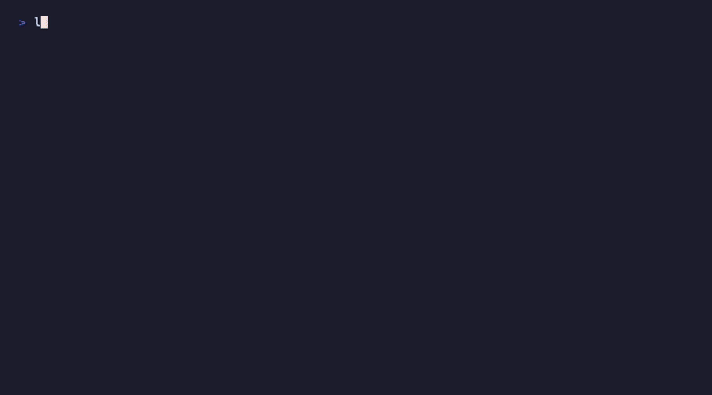
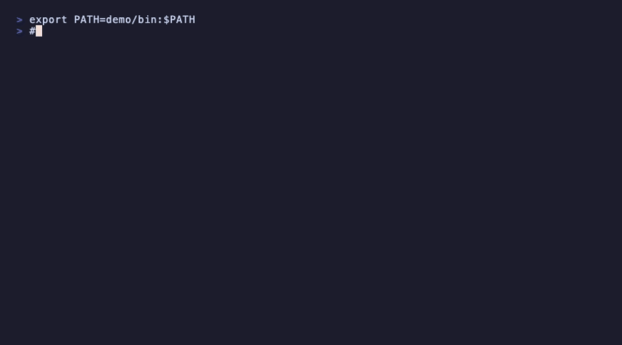

<p align="center">
  
</p>

```
echo "lux" | lux -r "(l):yellow:cap1" -r "(u):magenta:cap1" -r "(x):cyan:cap1"
```

**Lit Up teXt** — colors your logs, highlights your files, and filters your output. Pipe anything through it and get the right colors applied to the right patterns, zero configuration needed for common cases.

## Install

**Pre-built binary (recommended):**

```bash
curl -fsSL https://raw.githubusercontent.com/grimurjonsson/lux/main/scripts/install.sh | bash
```

**From source:**

```bash
git clone https://github.com/grimurjonsson/lux.git
cd lux
just install
```

Requires [Rust](https://rustup.rs/) and [just](https://github.com/casey/just).

## Quick Start

```bash
lux -f app.log                              # follow with auto-coloring
lux -f app.log -r 'ERROR:red'               # add custom rules
lux -f app.log -t ERROR -b 5 -a 10          # trigger on ERROR with context
```

<p align="center">
  
</p>

## Usage

### Pipe mode

Pipe any output through `lux`. Log levels are colored automatically:

```bash
tail -f /var/log/syslog | lux
docker logs -f myapp | lux
kubectl logs -f pod/api | lux
```

<p align="center">
  
</p>

### File mode

Read a file directly — prints with syntax highlighting (like `cat` with colors):

```bash
lux README.md
lux config.yaml
lux src/main.rs
```

Show last N lines (like `tail`):

```bash
lux -n 50 app.log
```

Open in interactive pager instead (like `less`):

```bash
lux --less app.log
```

Navigate with `Space`/`b` (page), `j`/`k` or arrows (line), `g`/`G` (top/bottom), `q` to quit. Text selection and copy works normally.

Follow a file (like `tail -f`):

```bash
lux -f app.log       # follow by descriptor
lux -F app.log       # follow by name (handles log rotation)
```

Set the default file mode:

```bash
lux config default-file-mode less   # use pager
lux config default-file-mode cat    # print-and-exit (default)
```

Markdown files get an extra touch: GFM tables are rendered as aligned
box-drawn tables (only when color is on — piped output keeps the raw source).

With `--expand-refs`, a line containing just `@other.md` pulls that file's
rendered content inline, framed in a colored gutter — includes nest, cycles
are detected, and missing files degrade to an inline note.

### Syntax highlighting

Open code and config files with automatic syntax coloring (powered by [syntect](https://github.com/trishume/syntect) with Catppuccin Mocha theme):

```bash
lux src/main.rs
lux config.yaml
```

<p align="center">
  
</p>

### Custom rules

Add coloring rules with `-r PATTERN:STYLE[:SCOPE]`:

```bash
# Color ERROR lines red, WARN lines yellow
tail -f app.log | lux -r 'ERROR:red' -r 'WARN:yellow'

# Bold + color
echo "CRITICAL failure" | lux -r 'CRITICAL:bold+red'

# Color only the matched text (not the whole line)
echo "user=admin action=login" | lux -r 'admin:green:match'

# Color only a capture group
echo "time=12:34:56 msg=hello" | lux -r 'time=(\S+):cyan:cap1'

# Negative lookahead: match "error", but not "error-style"
echo "error error-style" | lux --no-profile -r 'error(?!-style):red:match'
```

**Rule format:** `PATTERN:STYLE[:SCOPE]`

| Part | Description |
|------|-------------|
| `PATTERN` | Regex pattern to match |
| `STYLE` | Color/style (see below) |
| `SCOPE` | `line` (default), `match`, or `cap1` |

**Styles:** `red`, `green`, `yellow`, `blue`, `magenta`, `cyan`, `white`, `dim`, `bold`, `italic`, `underline`. Combine with `+`: `bold+red`. Use hex (`#ff5500`), 256-color (`208`), or `bg-color` for backgrounds.

Run `lux --list-colors` to see all available colors and styles.

User patterns support lookaround, including negative lookahead (`(?!...)`),
in rules, include/exclude filters, triggers, and before/after context boundaries.
Ordinary patterns use the fast regex engine; advanced patterns may backtrack.
If a pattern exceeds the backtracking limit, lux reports an error rather than
silently skipping the match.

CLI rules have priority over profile rules, which have priority over global
config rules. A `-r` rule **replaces every profile/global rule with the exact
same pattern string**, including its old scope and insertion template.
Unrelated rules remain active; repeated CLI rules remain additive, with the
first winning overlapping colors.

For example, if your profile colors whole `ERROR` lines red, `-r 'ERROR:green:match'`
instead colors only `ERROR` green, without retaining the profile's line coloring.
Pattern identity is textual: `ERROR` and `(?i)error` are different patterns.

<p align="center">
  
</p>

### Filtering

Show only lines matching a pattern:

```bash
tail -f app.log | lux -i 'ERROR|WARN'
```

Hide lines matching a pattern:

```bash
tail -f app.log | lux -e 'DEBUG' -e 'TRACE'
```

Combine both:

```bash
tail -f app.log | lux -i 'user-service' -e 'healthcheck'
```

<p align="center">
  
</p>

### Triggers

Suppress output until a pattern matches, then show a context window around it:

```bash
# Show 20 lines before and after each ERROR
tail -f app.log | lux -t 'ERROR'

# Custom context window
tail -f app.log | lux -t 'ERROR' -b 5 -a 10

# Multiple triggers
tail -f app.log | lux -t 'ERROR' -t 'FATAL'

# Use a regex boundary instead of line count
tail -f app.log | lux -t 'ERROR' -b '^===' -a '^---'
```

<p align="center">
  
</p>

### Profiles

Profiles bundle rules, triggers, and settings into a reusable configuration. Lux ships with built-in profiles for common formats:

- **logs** — log level coloring (auto-selected for `.log` files)
- **help** — CLI help text coloring (auto-detected from content)

Syntax highlighting (Markdown, YAML, TOML, Rust, Python, etc.) is handled automatically via [syntect](https://github.com/trishume/syntect) when reading files directly.

Select a profile explicitly:

```bash
lux -p logs -f app.log
cat output.txt | lux -p myapp
```

List available profiles:

```bash
lux --list-profiles
```

Create your own profiles in `~/.config/lux/config.toml`:

```toml
[profiles.django]
extensions = ["log"]

[[profiles.django.rules]]
pattern = "django\\.request"
style = "bold+magenta"
scope = "match"

[[profiles.django.rules]]
pattern = "\\d{3}"
style = "cyan"
scope = "match"
```

Manage profiles interactively:

```bash
lux profile new        # create a profile with the interactive wizard
lux profile edit       # edit an existing profile
lux profile delete     # delete a profile
lux profile list       # list all profiles
```

Set a default profile:

```bash
lux profile set-default logs
lux profile clear-default
```

<p align="center">
  
</p>

### Local profiles

Override or add profiles per-repo or per-directory — useful for project-specific log formats that you can commit alongside your code.

Lux checks two locations (highest priority wins):

| File | Scope | Typical use |
|------|-------|-------------|
| `.lux/profiles.toml` | Repository root | Shared team profiles — commit to git |
| `.lux_profiles.toml` | Current directory | Personal/directory-specific overrides |

The repo root is found by walking up from CWD looking for `.git`. If CWD _is_ the repo root, both files are checked and `.lux_profiles.toml` wins on name collisions.

**Override chain** (highest priority first):

```
CWD/.lux_profiles.toml  >  <repo>/.lux/profiles.toml  >  ~/.config/lux/config.toml  >  built-ins
```

**Example** — add a `.lux/profiles.toml` to your repo:

```toml
[profiles.myapp]
extensions = ["log"]
slow = "5s"

[[profiles.myapp.rules]]
pattern = "ERROR|FATAL"
style = "bold+red"
scope = "line"

[[profiles.myapp.rules]]
pattern = "req_id=(\\S+)"
style = "cyan"
scope = "cap1"
```

Now anyone who clones the repo gets the `myapp` profile automatically when viewing `.log` files:

```bash
lux -f app.log              # auto-selects myapp profile via extension match
lux -p myapp -f app.log     # or select explicitly
```

Local files use the same `[profiles.*]` format as the global config. Other top-level fields (`default_profile`, `theme`, etc.) are ignored in local files.

Run `lux --list-profiles` to see all profiles and where they come from — local profiles are tagged with their source path.

### Configuration

Config file location: `~/.config/lux/config.toml` (or `$XDG_CONFIG_HOME/lux/config.toml`).

```toml
# Default profile when no --profile or extension match
default_profile = "logs"

# Syntax highlighting theme (run `lux --list-themes` to see options)
theme = "Catppuccin Mocha"

# Custom syntax mappings
[syntax_map]
justfile = "Makefile"
tf = "HCL"

# Global rules (applied when no profile is active)
[[rules]]
pattern = "ERROR"
style = "bold+red"
scope = "line"

# Named profiles
[profiles.myapp]
extensions = ["log", "txt"]

[[profiles.myapp.rules]]
pattern = "(?i)error"
style = "red"
scope = "line"

[[profiles.myapp.rules]]
pattern = "(?i)warn"
style = "yellow"
scope = "line"

# Profiles can include trigger settings
[profiles.errors-only]
trigger = ["ERROR", "FATAL"]
before = "10"
after = "5"

[[profiles.errors-only.rules]]
pattern = "ERROR"
style = "bold+red"
```

### Discovery commands

```bash
lux --list-colors      # all color names and styles
lux --list-profiles    # available profiles
lux --list-themes      # syntax highlighting themes
lux --list-syntaxes    # syntax definitions and file extensions
```

### Shell completions

```bash
# Generate and install zsh completions
just install-completions

# Or manually for any shell
lux completions bash > ~/.bash_completion.d/lux
lux completions zsh > ~/.zsh/completions/_lux
lux completions fish > ~/.config/fish/completions/lux.fish
```

## Reference

`lux -h` and `lux --help` show the same compact reference, grouped by task.
Headings and flags are styled in a terminal; piped output stays plain text.
Help wraps to your terminal width, up to 100 columns.

<!-- BEGIN REFERENCE (auto-generated by `just release-*`) -->
```
Lit Up teXt — instantly readable colored output

Usage: lux [OPTIONS] [FILE] [COMMAND]

Commands:
  completions  Generate shell completions
  profile      Manage config profiles (new, edit, delete, list)
  update       Check for updates and upgrade interactively
  config       Manage lux configuration
  help         Print this message or the help of the given subcommand(s)

Arguments:
  [FILE]  Read a file, or pipe text to stdin

Options:
  -h, --help     Print help
  -V, --version  Print version

Rules & color:
  -r, --rule <RULE>    Color text with PATTERN:STYLE[:SCOPE] (reference below)
      --color <WHEN>   Color output: auto, always, never [default: auto]
      --theme <THEME>  Syntax theme (overrides config.toml)

Profiles & config:
  -p, --profile <PROFILE>        Select a named profile
      --no-profile               Skip auto profiles and syntax; keep -r rules
      --ignore-missing-profiles  Allow missing profiles (for shared configs)
      --config <PATH>            Config file (instead of XDG discovery)

File viewing:
  -f                 Follow descriptor; do not reopen after rename/delete
  -F                 Follow name; reopen on rename/truncate/recreate
      --expand-refs  Expand own-line @file.md references in Markdown [alias:
                     --expand-referenced-files]
      --less         Open in an interactive pager (like less)
      --cat          Print and exit (default)
  -n <N>             Last N lines, or +N to start at line N

Filtering & context:
  -t, --trigger <REGEX>    Show matching lines and their context; hide the rest
  -b, --before <N|REGEX>   Before: line count or regex boundary [default: 20]
  -a, --after <N|REGEX>    After: line count or regex boundary [default: 20]
  -i, --include <REGEX>    Only show matching lines
  -e, --exclude <REGEX>    Hide matching lines
      --strip-ansi <MODE>  ANSI: auto/always strip; never keeps [default: auto]

Timing:
      --slow <DURATION>     Mark delays: 500ms, 5s, 1m30s (pipe/follow only)
      --slow-style <STYLE>  Delayed-line style [default: dim+yellow]

Discovery:
      --list-profiles  Available profiles
      --list-colors    Color names and styles
      --list-themes    Syntax highlighting themes
      --list-syntaxes  Syntax names and file extensions

Rule reference:
  PATTERN:STYLE[:SCOPE]                 e.g. 'ERROR:bold+red:match'
  line (default)  whole line            match  matched text only
  capN            capture group N       nextN  next N lines after a match
  insert-before:TEXT / insert-after:TEXT insert a line before / after
  prepend:TEXT / append:TEXT            add text to the matching line

  Patterns support lookaround: 'error(?!-style):red:match'.
  -r replaces profile/global rules with the exact same pattern.
  Repeat -r, -i, -e, or -t for multiple patterns.

Examples:
  tail -f app.log | lux -r 'ERROR:red'   Color a stream
  lux app.log -t ERROR -b 5 -a 10        Show errors with context
  lux README.md --less                  Browse with the pager

Use 'lux <command> --help' for command details.
```
<!-- END REFERENCE -->

## License

MIT
